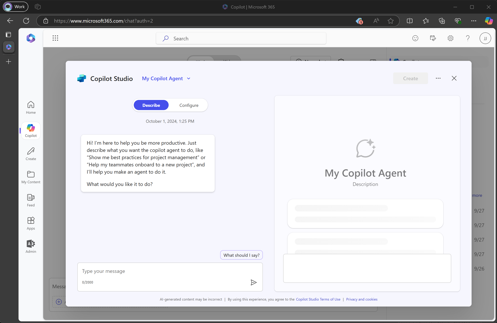
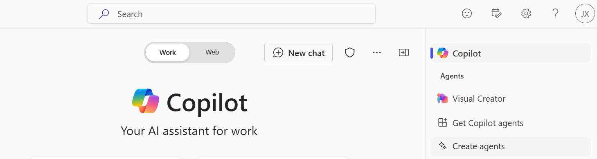
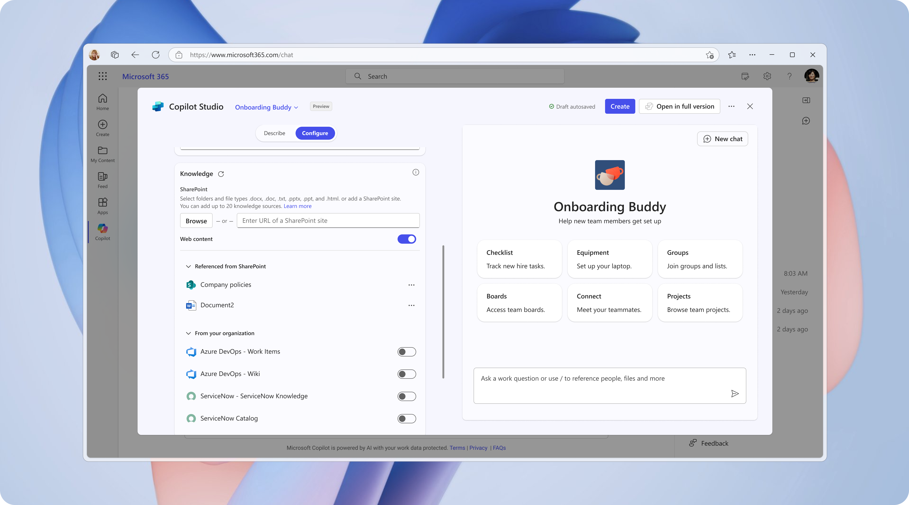
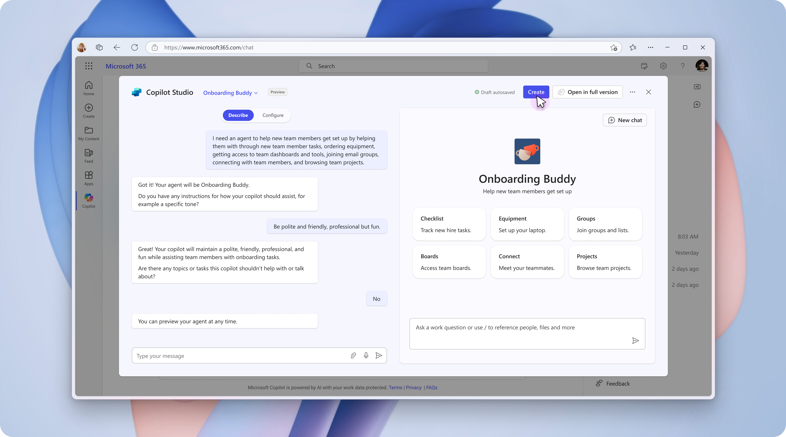
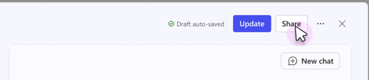
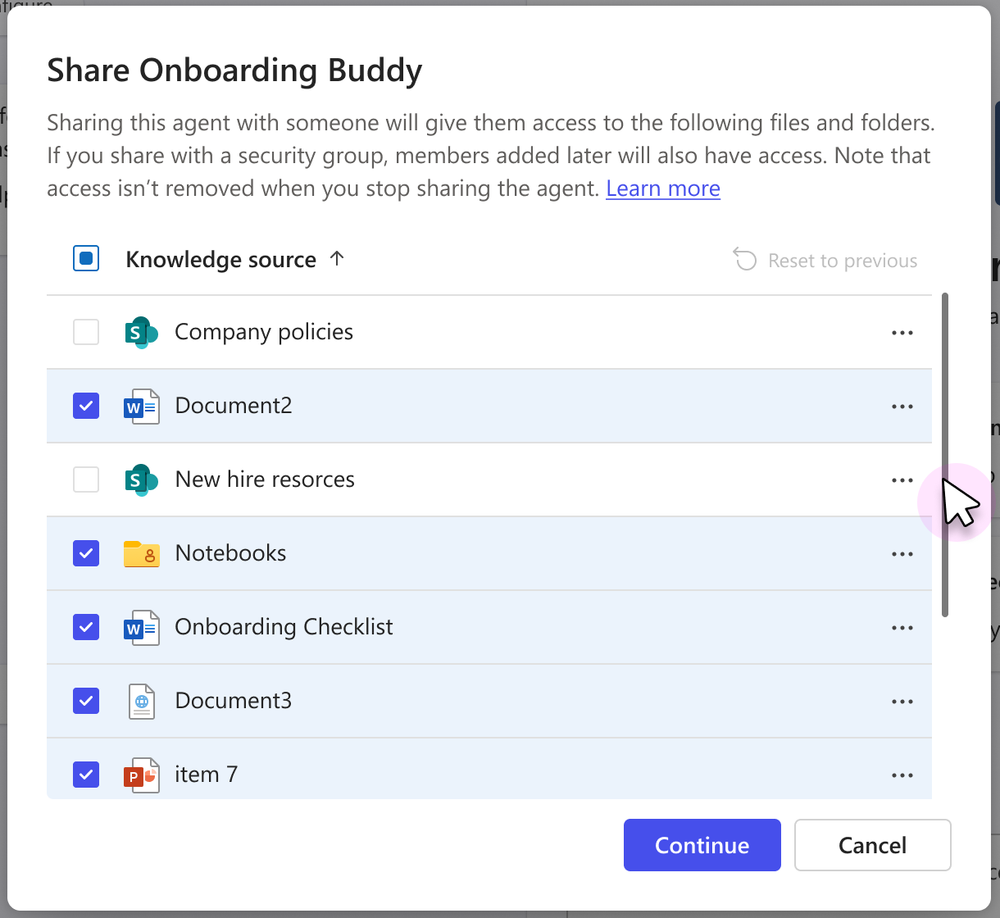
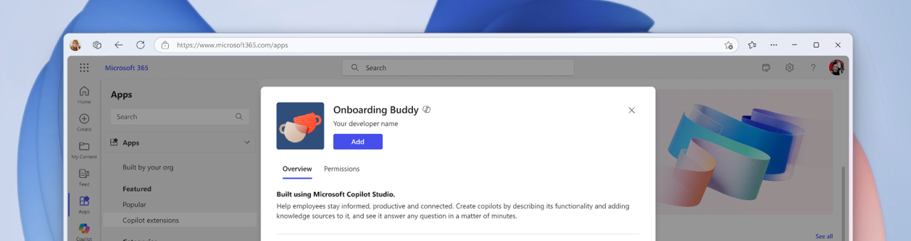
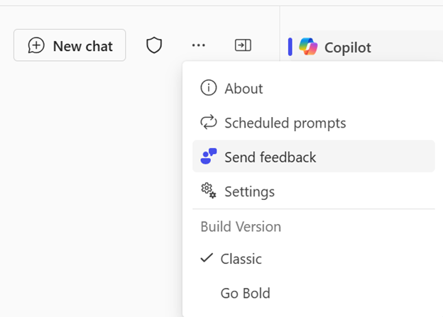
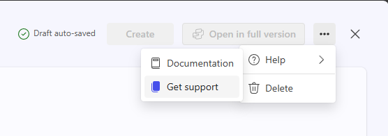
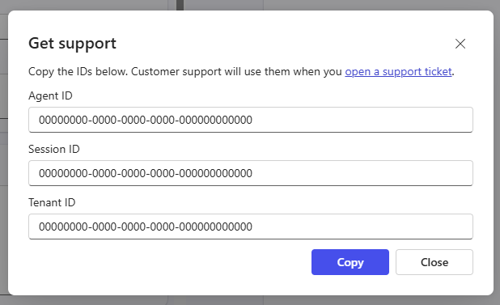

# Copilot Studio Agent Builder 
<!--- NOTE TO EDITOR: This feature will be release as GA on October 9, 2024. --->

Build Copilot agents for [Microsoft 365 Copilot](https://learn.microsoft.com/copilot/microsoft-365/microsoft-365-copilot-overview) easily and quickly with the Copilot Studio agent builder in Microsoft 365 Business Chat.  <!-- NOTE TO EDITOR: Please align the current Copilot naming with latest marketing changes-->

The Copilot Studio agent builder lets you create and customize Copilot agents that can be used with Microsoft 365 Copilot to cover scenario-specific uses cases that you or your organization can use in your everyday work. 

For example, you might want to create an agent that provides writing or presentation coaching that is tailored to organizational standards or a team onboarding agent that responds with specific information about the user’s new team and helps them complete onboarding tasks. 

 

These agents are also referred to as "[declarative agents](https://learn.microsoft.com/microsoft-365-copilot/extensibility/overview-declarative-agent)", because you can simply *declare* instructions, knowledge and actions to extend Microsoft 365 Copilot. Declarative agents run on the same orchestrator, foundation models, and trusted AI services that power Microsoft Copilot.  You don’t need to understand the intricacies of conversational user experience, turn-based conversations, prompt engineering or modification, or any coding languages. 

You can specify dedicated knowledge sources—including  content on SharePoint and information provided by Graph connectors—preview, and test the agent, before deploying it for use in your conversations with Microsoft 365 Copilot or sharing it with others in your organization.

You can build agents from the following apps and sites:
- microsoft365.com/chat
- office.com/chat
- Microsoft Teams Desktop and Web client
- Microsoft Outlook Desktop and Web client

> [!NOTE]
> Agent builder is only available under the Work section of Microsoft 365 Copilot app. It is not available on mobile versions of these apps and sites, or for Microsoft 365 Copilot locations that are not listed in this article.
 
 

## Prerequisites

You need a license for [Microsoft 365 Copilot](https://www.microsoft.com/microsoft-365/copilot/enterprise) with the "Copilot Studio in Copilot for M365" app enabled. Admins can assign or unassign licenses for users in the [Microsoft 365 admin center](https://learn.microsoft.com/microsoft-365/admin/manage/assign-licenses-to-users?view=o365-worldwide).

## Availability and Language Support 

### Geographic Availability
The agent builder is available in these geos: Australia, Brazil, Canada, Europe, Germany, India, Japan, Switzerland, United Arab Emirates, United Kingdom and United States. 

In regions where the agent builder is not yet supported, the user has the option to create a Copilot agent in the full version of [Copilot Studio](https://learn.microsoft.com/microsoft-copilot-studio/fundamentals-get-started?tabs=web)

### Agent Languages
A user can chat with an agent created using the Copilot Studio agent builder using any of the following languages: English, French, German, Italian, Japanese, Portuguese, Spanish, and Simplified Chinese. You can create agents to engage with users in the supported languages.

### Authoring Languages
The authoring language is the one in which the authoring UI is presented. By default, this is the same language as your M365 language setting. You can change the authoring language by [changing your M365 language setting](https://support.microsoft.com/topic/change-your-display-language-and-time-zone-in-microsoft-365-for-business-6f238bff-5252-441e-b32b-655d5d85d15b).

The following authoring languages are supported: cs-CZ, da-DK, de-DE,  el-GR,  en-US, es-ES, fi-FI,  fr-FR, hi-IN, id-ID, it-IT, ja-JP, ko-KR, nb-NO, nl-NL, pl-PL, pt-BR, ru-RU, sv-SE,  th-TH, tr-TR, zh-CN, zh-TW. 

## Author A Copilot agent
The Agent Builder allows you to author a Copilot agent in two ways: either using natural language (Describe tab) or manually (Configure tab). Both tabs work seamlessly to provide a rich authoring experience.

The availability of the Describe tab is based on geographic availability as well as language support. The Conversational Builder only supports English. When the authoring language is set to English, the Conversational Builder is available in the following regions: Australia, India, Japan, United Arab Emirates, United Kingdom and United States. You can build your agent via the Configure tab if the Conversational Builder is unsupported in your region or preferred language. 

### Describe your Copilot agent 
The Describe tab allows you to create an agent using plain language. As you provide information conversationally, the copilot’s name, description and instruction update continuously to refine the agent’s behavior. This experience provides a rich yet simple natural language way of creating a customized Copilot agent. After creating your own Copilot agents, you can return to the agent you’ve authored and use the Conversational Builder to update the agent using natural language.

You build agents in plain language by answering the questions the agent builder asks. The builder progressively updates the Copilot agent in each turn of the conversation, and changes are automatically saved. You can make updates to the Copilot agent in any turn of the conversation. Changes to the agent’s name, description, and instructions will update automatically. However, you can’t add an icon or knowledge sources directly from the Conversational Builder—for knowledge sources, you’ll need to go into the Configure tab.

### Configure your Copilot agent 
In addition to using the Conversational Builder described above, you can also directly configure the agent’s behavior using the Configure tab. 

The Configure tab provides you with the ability to view and edit information about the agent, giving you more control and more precision. Describe and Configure tab are in sync, the fields in the Configure page update to reflect the latest changes from Describe. You can switch between the tabs to use the experience that is most comfortable to you to author the agent. 

 

The following table describes the fields that make up the Copilot agent:

| Field	| Description |
|----------|----------|
| Name	| This is the name of your agent. Otherwise use something that is descriptive and unique Character limit of 30 characters. |
| Icon	| You can manually upload an image to represent your agent and give it a unique personality. <ul> <li> Supported file types: PNG </li> <li>Color icon resolution limit of 192x192 pixels </li> <li> File size limit of 1 MB </li> </ul> A PNG file with a transparent background works best due to the extra padding that is applied by default around your icon.|
| Description| This helps the Large Language Model (LLM) identify and use your agent for a specific task or situation. Make it as short, precise and simple as possible. The description is also displayed in the app file for use in the app catalog. Character limit of 1000 characters. |
| Instructions	| These are the specific instructions to the Large Language Model (LLM) that you want to use to extend the capabilities of Microsoft 365 Copilot. They direct the behavior of the agent, including its tasks and how it completes them. If you’re using the Conversational Builder, they will be auto-generated for you.  Character limit of 8000 characters. |
| Starter Prompts	| Starter prompts help other users understand commonly supported scenarios by your agent. Each starter prompt comes with a name and description. There is no minimum number of starter prompts. |
| Knowledge |	You can specify up to 20 knowledge sources (including SharePoint sites, folders, and files) or utilize Graph connections that have been set up by your tenant admin. See the Knowledge section below to learn more. |

 
## Try your Copilot agent
The agent on the right pane is an ephemeral instance of the user’s desired Copilot agent that shows up as a side-by-side screen within the authoring experience. It can be used to test the Copilot agent while creating it or while making subsequent updates, so you can test the agent before deploying updates to end users. 

Using the test pane, you can easily test your Copilot agent to experience it in a similar way to end users. It allows you to enter prompts once you’ve entered or used the Describe tab to add a Name, Description, and Instructions for your Copilot agent. Once entered, it’ll behavior according to those instructions like a fully-fledged Copilot agent, including the ability to respond to complex queries within its realm of specified knowledge. The agent updates during each turn of the conversation as new information is added in the Describe or Configure pane. 

Unlike a fully-fledged, created Copilot agent, the agent you see in the test pane has not yet been created yet. For example, you can’t use it to share prompts, provide feedback, or @mention other agents in the Microsoft 365 Copilot app—these features become available after creating the full Copilot agent. 

The test pane initially appears with suggested starter prompts, which when clicked invokes the prompt and starts the conversation. You can select "New Chat" to start a new conversation with the agent to view the starter prompts again.

## Knowledge 
The agent builder allows you to configure specific knowledge sources for the agent to reference. This feature helps the Copilot agent provide more relevant answers based on specific files, folders, and sites from SharePoint as well as [Microsoft Graph connectors](https://learn.microsoft.com/graph/connecting-external-content-connectors-overview).   

### Web
You can enable/disable Web content when authoring or editing your Copilot agent. 

When enabled, the Copilot agent can use publicly available Web information to augment its response to a prompt. Responses shown to the user are also shown with citations and labeled with an icon to represent potential Web content use. 

When disabled, the Copilot agent will use its pretrained knowledge and any knowledge sources you add.

### SharePoint 
The Copilot agent can reference specific SharePoint site, file, and folders as its knowledge source. When referencing sources from SharePoint, consider the following: 
- Supported file types: .docx, .doc, .pdf, .txt, .pptx, .ppt, .html
- Individual files needs to be equal or less than 150 MB 
- A total of 20 Knowledge sources (including sites, folders, and files) can be selected for each Copilot agent.
- Files already uploaded to SharePoint may have existing permissions and [sensitivity labels](https://learn.microsoft.com/purview/sensitivity-labels), which are respected when the Copilot agent is generating a response.

> [!IMPORTANT]
>  If [Restricted SharePoint Search](https://learn.microsoft.com/en-us/sharepoint/restricted-sharepoint-search) is enabled, you won’t be able to use SharePoint as a knowledge source.

#### Pasting a link from SharePoint site or folder
You can link a URL from a SharePoint site, such as *contoso.sharepoint.com/sites/policies*. The Copilot agent searches the URL and subpaths. For example, a URL such as *contoso.sharepoint.com/sites* also includes subpaths like *contoso.sharepoint.com/sites/policies*. The Copilot agent will use relevant information to provide a targeted response.  

> [!NOTE]
> Recognized SharePoint URLs are from the sharepoint.com domain and contain the path {org}.sharepoint.com/sites/{site}
> SharePoint site URLs can't be more than two levels deep.
> Only modern pages are supported.
> Content from classic aspx pages on SharePoint aren't used to generate answers.

After providing the SharePoint site URL, press the "Enter" key to add it as a knowledge source.

#### Opening the SharePoint file picker
You can also select files or folders from the SharePoint file picker. On the left pane, you'll see your OneDrive Business file and recently accessed SharePoint sites. You can view more SharePoint sites by clicking "More places", where you’ll see the 12 most recently opened sites under the "Recent" section as well as [SharePoint team sites](https://learn.microsoft.com/microsoft-365/community/team-site-or-communication-site) that you have access to under "Your Teams". If you recently created a site, it will appear after several minutes. 

> [!NOTE]
> The SharePoint picker may not show all the [communication sites](https://learn.microsoft.com/microsoft-365/community/team-site-or-communication-site) that you have access to. Communication sites only show up in the "Quick Access" and "Recent" sections of the SharePoint picker.

After selecting a site, you can select several files and folders. Doing so references the SharePoint file or folder into the Copilot agent’s knowledge sources. When there are multiple folders in the same site, click the button next to the folder name to view other folders. 

 
 
You can also upload files into SharePoint using the picker. The file will appear in the same folder once it is finished uploading and will be ready for use in agent builder. 

#### File readiness 
When new files are uploaded to SharePoint, they can take up to several minutes to be ready for Copilot agent to include in its response. You can still test your Copilot agent with the test pane even if sources are not ready; however, responses will not include information from the newly uploaded file until it is ready. You can check the file readiness by looking in the Knowledge section in the Configure tab; the file will have the word "Processing" next to it. 

When the underlying file uploaded to SharePoint has been renamed or deleted, the Copilot agent will pick up the changes. You can also click the reload button on top of the Knowledge section to manually reload the state. 

> [!NOTE] 
> The test pane can still be used even when certain Knowledge sources are not ready for consumption. The Copilot agent does not provide responses from those sources until it finishes preparation.

 

#### Graph connectors
Graph connectors allow Copilot agents to include knowledge from external repositories or Systems of Record such as customer accounts, incident tickets and knowledge articles. 

Admins must enable and configure Graph connectors in the [Microsoft Admin Center](https://learn.microsoft.com/en-us/microsoftsearch/configure-connector). At first, the connectors may be collapsed in the "From your organization" section of the Knowledge sources. 

If at least one connector has been enabled, you can add it to your Copilot agent. Your agent will then be able to answer questions related to that connector. Because the connector is set up at the tenant level, the information retrieved from the connector is indexed and refreshed according to the way in which the connector was set up. The Copilot agent may cite relevant information from the indexed data and link the end user to the data source.

 

## Create the Copilot agent 
Changes made to the Copilot agent are automatically saved in the agent builder. When you’re satisfied with its behavior and content, you can create the Copilot agent to use it in Microsoft 365 Copilot by selecting "Create" on the top right corner.

Once the Copilot agent is created successfully, selecting "Go to agent" will bring you back into Microsoft 365 Copilot with a new chat opened with the Copilot agent. You can easily return to chat with their Copilot agents from the right rail of Microsoft Copilot.

 

## Share the Copilot agent
You can share your Copilot agent with other users via a link once it has been created. When sharing an agent, the people you share the agent with can use it, but they can’t edit it.

You can change the sharing option at any time by clicking the "Share" button at the top right corner.

 
 
### Sharing options
Several sharing options are available:
| Sharing option |	Description |
| --- | --- |
| Anyone in your organization	| Anyone in your tenant can use the sharing link to use the Copilot agent.|
| Specific users in your organization via security groups |	Specific user groups can use the sharing link to use the Copilot agent. These user groups must be specified via [security groups](https://learn.microsoft.com/microsoft-365/admin/email/create-edit-or-delete-a-security-group?view=o365-worldwide) in your tenant’s Microsoft directory. |
| Only me	| Only the author of the Copilot agent can use the Copilot agent. The sharing link cannot be used by anyone else. This sharing option is selected by default. |

> [!NOTE] 
> Copilot agents can only return information from knowledge sources that the shared users have access to. If your copilot contains knowledge sources from SharePoint files and folders, it is recommended to share the copilot with specific users in your organization via security groups to automatically share the files with users so copilot can return responses from those sources.

### Automatically share SharePoint file and folder
When sharing the agent, Copilot users may not have access to all the underlying knowledge sources. The Copilot agent respects the end user’s information and sensitivity privileges. If the user doesn’t have access to a knowledge source, the Copilot agent will not include content from it when generating a response.

You can automatically share the underlying Knowledge sources to security groups when the Share option is set to "Specific users in your organization via security groups". 

> [!NOTE] 
> Only files and folders added to the agent can be automatically shared. SharePoint sites will not be automatically shared; you or the site admin will need to grant user permission via site setting if you are the site admin.

You can select which folder or files to share. Sharing only works when the author of the Copilot agent already has permissions to share or update the sharing permissions. [File sensitivity](https://learn.microsoft.com/purview/sensitivity-labels) applied to files in SharePoint or OneDrive is also respected. 

If the sharing on a file or folder fails, the Copilot agent will still be shared with the users. The author will need to contact the file owners or the SharePoint site admin to grant permission to the file or folder directly from SharePoint.

When a user’s access to the Copilot agent is removed, it will not affect their access to the shared file or folders. Use file permission management in SharePoint to manage user’s access to the files and folders.

 

## Copilot agent acquisition
The shared link brings end users to the office.com app store to view the details of the agent before adding it to Microsoft Copilot. After adding it, they can open the Copilot agent in Microsoft Copilot with a new chat created. This only needs to be done the first time for a Copilot agent, users can return to Microsoft Copilot to find the agent on the right rail for subsequent uses. 

 

## Manage Copilot agents 
To manage an existing agent, you can:
1. Select "…" and "Edit" from a Copilot agent on the right rail of Microsoft Copilot
1. Select "Create agents" from the right rail of Microsoft Copilot and select the "View all agents" option from the name drop down menu

 
 
Both options will show the "My agents" list. You can select the existing agent that you want to change or update.

> [!NOTE] 
> Only Copilot agents created by you will show in the "My agent" list. Agents via shared link do not grant others permission to edit the agent and will not be on the list. 
 
### Update your Copilot agent
Changes made to Copilot agents are automatically saved in the agent builder. The Copilot agent author will need to update their agent for it to receive the latest configuration in Microsoft Copilot. Shared users of the Copilot agent will not see the latest changes until it has been updated. To update a previously created agent, select "Update" on the top right corner. Your changes may take several minutes to propagate for end users.
 
 

> [!NOTE] 
> It is highly recommended to re-share your Copilot agent with the same group of users when the Copilot agent has SharePoint file and folder knowledge source and have been shared with specific users in the organization. This will auto share the files and folders again with the users to ensure consistent copilot experience. 

### Delete your Copilot agent
The Copilot agent author can delete their existing Copilot agents. After deletion, the Copilot agent will no longer be available to the author or shared users to use in Microsoft Copilot. 
    
>[!IMPORTANT]
> Deleting a Copilot agent is permanent and cannot be reversed.

To delete an agent, follow one of the options below:
1. Select "…" and "Delete" in the "My Agents" list
1. From the authoring experience of a Copilot agent, select "…" and "Delete" from the top right corner.

## Troubleshooting 
When sharing an agent and its knowledge sources, you might encounter these errors: 
| Error code	|Description |
| --- | --- |
| Something went wrong	| An internal service error message. Please contact support if this continues to occur.
| Couldn’t share |	Insufficient privileges to update the sharing permissions on certain files. Will list the files that were unable to be shared. The copilot owner should go into SharePoint to try updating these permissions manually. See <ul> <li> https://support.microsoft.com/en-us/office/share-a-document-using-sharepoint-or-onedrive-807de6cf-1ece-41b9-a2b3-250d9a48f1e8 to learn how to share files </li> <li> https://learn.microsoft.com/en-us/sharepoint/sharepoint-onedrive-error-message and for reference on error codes</li></ul>|

If sharing failed, users who don’t have access to the folder and files will not receive copilot a response generated from those Knowledge sources. Checking the box will share the underlying Knowledge sources via through SharePoint. Files can only be shared to valid individuals or security groups in your directory.

## Get Support
To get support, please click "Send feedback" in M365 Copilot. 
  

In your feedback ticket, please detail the issue you are facing and include the following pieces of information in the feedback dialog:
- Specify that the issue is related to "Copilot Studio"
- Agent ID
- Tenant ID
- Session ID
- If the issue is related to the test pane  or Describe Tab, please also type "/debug" within the chatbox and include the contents in your ticket
 You can find and copy these details in the Copilot Studio agent builder within the "Get support" section of the Help dropdown menu.

 
 

## Governance
Admins can govern this feature by revoking access to the "Copilot Studio in Copilot for M365" application within the "Microsoft 365 Copilot" license in the Microsoft Admin Center. To learn more about the Microsoft 365 Copilot license, see [Microsoft Microsoft 365 Copilot—Features and Plans](https://www.microsoft.com/microsoft-365/copilot/enterprise). To learn more about how to assign or unassign licenses for users in the Microsoft 365 admin center, see [Assign or unassign licenses](https://learn.microsoft.com/microsoft-365/admin/manage/assign-licenses-to-users?view=o365-worldwide).

## Compliance 
### Data Subject Rights
The European Union (EU) General Data Protection Regulation (GDPR) gives significant rights to individuals regarding their data. Refer to the Microsoft Learn [General Data Protection Regulation Summary](https://learn.microsoft.com/compliance/regulatory/gdpr) for an overview of GDPR, including terminology, an action plan, and readiness checklists to help you meet your obligations under GDPR when using Microsoft products and services.

You can learn more about GDPR and how Microsoft helps support it and our customers who are affected by it.
- The [Microsoft Trust Center](https://www.microsoft.com/trust-center/privacy/gdpr-overview) provides general information, compliance best practices, and documentation helpful to GDPR accountability, such as Data Protection Impact Assessments, Data Subject Requests, and data breach notification.
- The [Service Trust portal](https://servicetrust.microsoft.com/ViewPage/GDPRGetStarted) provides information about how Microsoft services help support compliance with GDPR. 

For more information and guidance, see the [Dynamics 365 Data Subject Requests guide](https://learn.microsoft.com/compliance/regulatory/gdpr-dsr-dynamics365).

To delete your agent data, see Delete Copilot agents (link to the section).
> [!NOTE]
> Because access to your copilot is managed by your Microsoft Entra ID tenant administrator, other users with admin permissions have access to your copilot content.

### Requests to rectify personal data (Admin only)
If a data subject asks you to rectify their personal data that resides in your organization, you and your organization must determine if it's appropriate to honor the request. Rectifying the data might include taking actions such as editing, redacting, or removing personal data.

You can use Microsoft Entra to manage Copilot Studio users' identities. Enterprise customers can manage personal data rectify requests, including limited editing features, per the nature of a given Microsoft service. As a data processor, Microsoft doesn't offer the ability to correct system-generated logs because these logs reflect factual activities and constitute a historical record of events within Microsoft services.

## Known Limitations
- Only general web browsing, Graph connections, SharePoint sites, folders and files can be specified as knowledge sources. You may upload your local folders and files into SharePoint. Specifying specific public URL as knowledge source is not supported.
- Share with specific users in the organization only supports security groups and not individual users.
- Auto sharing SharePoint files and folders are only supported when sharing with specific security groups and not everyone in the organization. You will need to manually update the file and folder permission that the agent uses to grant permission to the intended users for the agent to return information from those knowledge sources.
- Agent builder does not yet support [Lockbox](https://learn.microsoft.com/power-platform/admin/about-lockbox) or Customer Managed Keys: https://learn.microsoft.com/azure/storage/common/customer-managed-keys-overview
- Agents created via Copilot Studio agent builder cannot be used in Teams Chat
