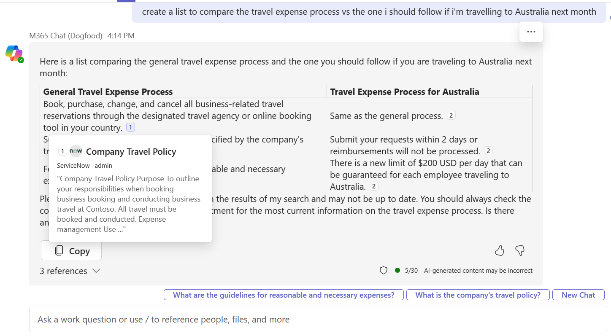
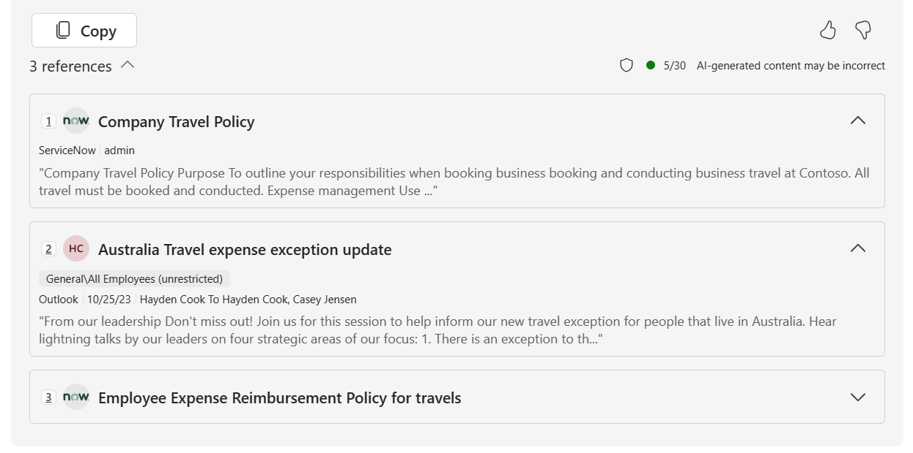

# Microsoft 365 Copilot connectors overview

Microsoft 365 Copilot connectors allow you to bring external, line-of-business data into Microsoft 365 Copilot so your users can search, reason over, and act on more of your enterprise content. The platform supports two connector models:

- **Synced connectors** ingest and index external content into Microsoft Graph.
- **Federated connectors** retrieve content in real time using Model Context Protocol (MCP) without indexing data into Microsoft Graph.

Both connector types power Microsoft 365 Copilot and other Microsoft 365 intelligent experiences, such as Microsoft Search, Context IQ, and Microsoft 365 Copilot.

> [!NOTE]
> Copilot connectors are available in commercial environments and in Microsoft 365 Government Community Cloud (GCC) and Government Community Cloud High (GCCH). They aren't available in Department of Defense (DoD) environments.

## Connector models

Microsoft 365 Copilot supports two connector models tailored to different integration needs.

| Capability | Synced connector | Federated connector (MCP-based) |
|-----------|----------------------------------------------|----------------------------------|
| Data movement | Content synced into Microsoft Graph | No data movement; query-time fetch |
| Semantic indexing | Supported | Not applicable |
| Schema | Defined using **externalItem** schema | Defined by MCP server resources |
| Use cases | Knowledge repositories, document stores, LOB systems | Dynamic data or regulated content that must remain in source |
| Authentication | Microsoft Entra ID app registration | MCP-supported methods (OAuth 2.0 or service-specific) |
| Content retrieval | Indexed search and synthesis | Real-time API calls |
| Availability | Global, GCC, GCCH | Varies by federated connector availability |

For more information about federated connectors, see [Federated connectors overview](/microsoftsearch/federated-connectors-overview).

## How connector content surfaces in Microsoft 365 Copilot

Synced connectors ingest content into Microsoft Graph where the data is semantically indexed and made available to Copilot. Users can find, summarize, and learn from this content using natural language prompts. They can also select citations in Copilot responses to preview external items stored in Microsoft Graph.

Federated connectors surface real-time information from your external service. Instead of referencing indexed items, citations refer to content returned directly from your MCP server. No content is synced or stored in Microsoft Graph.

If users want to explore referenced content, they can select one of the links at the bottom of the response.

## Synced connector semantic indexing

Synced connectors use semantic indexing to improve retrieval quality across Microsoft 365. Semantic indexing enables:

- More relevant search results beyond lexical matching
- Approximate and contextual matches
- Understanding of relationships between data points

The following common properties are indexed:

- **Title**: The item's title
- **Content**: The main body of the item

Custom connectors can also use semantic indexing. To optimize retrieval, include relevant information in the **title** and **content** fields.

> [!NOTE]
> [Semantic labels](/graph/connecting-external-content-manage-schema#semantic-labels) are used for filtering and don't affect semantic indexing. Federated connectors don't support semantic indexing.

The following scenarios benefit from semantic indexing:

- Topic- and keyword-based searches
- Queries requiring approximate matches
- Queries requiring contextual interpretation

The following scenarios don't benefit from semantic indexing:

- Queries without topics or keywords, such as "find bugs assigned to"
- Queries with multiple parameters (for example, topic + assignee)
- Queries requesting counts of items

## Copilot connectors gallery

The [Copilot connectors gallery](/microsoftsearch/connectors-gallery) includes descriptions of Microsoft and partner connectors with links to partner sites. With more than 100 connectors available, you can connect to Azure services, Box, Confluence, Google services, MediaWiki, Salesforce, ServiceNow, and more.

## Create your own synced Copilot connector

To build a synced connector, an AI administrator must [register an application](/graph/toolkit/get-started/add-aad-app-registration) and [grant admin consent](/graph/connecting-external-content-deploy-teams#update-microsoft-graph-permissions) for required Microsoft Graph permissions in the **Microsoft Entra admin center**.

Deployed connectors are tenant-wide unless external item security is restricted.

You can create a synced Copilot connector in one of three ways:

- Use the [Microsoft 365 Agents Toolkit](build-your-first-connector.md)
- Use the [connector SDK](/graph/custom-connector-sdk-sample-create)
- Use the [Copilot connector APIs](/graph/connecting-external-content-connectors-api-overview?context=microsoft-365-copilot/extensibility/context)

## Configure custom connectors for Microsoft 365 Copilot

To ensure Microsoft 365 Copilot uses your ingested content effectively:

- Apply [semantic labels](/graph/connecting-external-content-manage-schema). Apply all labels that match your schema, including `iconUrl`, `title`, and `url`.
- Ingest content-rich text into the **content** property to improve grounding quality.
- Add a [urlToItemResolver](/graph/api/resources/externalconnectors-urltoitemresolverbase) so Copilot can identify shared URLs.
- Add [user activities](/graph/api/externalconnectors-externalitem-addactivities) to improve item ranking.
- Provide meaningful descriptions during connection creation.

Administrators must also ensure that synced connectors are enabled for [inline results](/microsoftsearch/connectors-in-all-vertical).

## Microsoft 365 Copilot connector samples

The following samples implement Microsoft 365 Copilot connectors that extend Microsoft 365 Copilot.

| Sample | Description |
|--------|-------------|
| [TypeScript policies connector](https://adoption.microsoft.com/sample-solution-gallery/sample/pnp-graph-connector-nodejs-typescript-policies/) | This sample contains a Copilot connector that shows how to ingest local policies into Microsoft 365. For each file, it extracts the metadata from front matter, maps it to the external connection's schema, and ingests the content, retaining the content and metadata. The ingested content is set to be visible to everyone in the organization. |
| [.NET docs connector](https://adoption.microsoft.com/sample-solution-gallery/sample/pnp-graph-connector-dotnet-csharp-graphdocs-ttk/) | This sample .NET project shows you how to build a Copilot connector to ingest unstructured data to Microsoft 365 and make it available to Microsoft 365 Copilot. The project uses [Microsoft 365 Agents Toolkit](https://aka.ms/M365AgentsToolkit) for Visual Studio to package the connector as a Microsoft Teams app and simplify its deployment in the organization. |
| [.NET GitHub connector](https://github.com/microsoftgraph/msgraph-sample-github-connector-dotnet) | This .NET application shows you how to use the Copilot connector API to create a custom connector that indexes issues and repositories from GitHub. This connector sample powers experiences such as Microsoft Search, Copilot in Teams, the Microsoft 365 Copilot app, and more. |
| [Python GitHub connector](https://github.com/microsoftgraph/msgraph-sample-github-connector-python) | This Python application shows you how to use the Copilot connector API to create a custom connector that indexes issues and repositories from GitHub. This connector sample powers experiences such as Microsoft Search, Copilot in Teams, the Microsoft 365 Copilot app, and more. |
| [TypeScript GitHub connector](https://github.com/microsoftgraph/msgraph-sample-github-connector-typescript) | This TypeScript application shows you how to use the Copilot connector API to create a custom connector that indexes issues and repositories from GitHub. This connector sample powers experiences such as Microsoft Search, Copilot in Teams, the Microsoft 365 Copilot app, and more. |

You can find the latest list of samples from the community in the [Microsoft Adoption center sample solution gallery](https://adoption.microsoft.com/sample-solution-gallery/?keyword=&sort-by=updateDateTime-true&page=1):

- [Copilot connector samples](https://adoption.microsoft.com/en-us/sample-solution-gallery/?keyword=&sort-by=updateDateTime-true&page=1&product=Copilot+connectors)

## Related content

- [Build your first Copilot connector](build-your-first-connector.md)
- [Copilot connectors API](/graph/connecting-external-content-connectors-api-overview?context=microsoft-365-copilot/extensibility/context)
- [Prebuilt Copilot connectors](/microsoftsearch/pre-built-connectors-overview)
