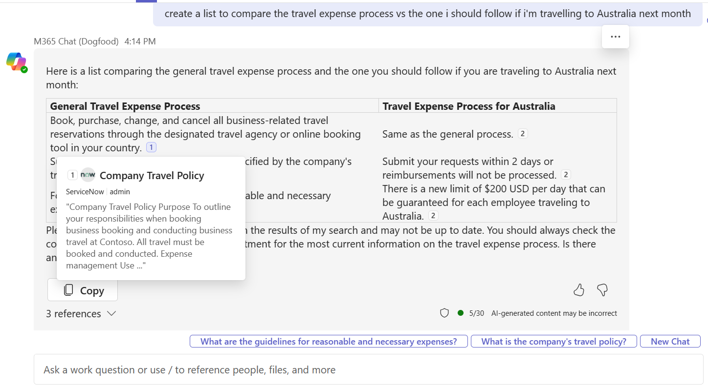
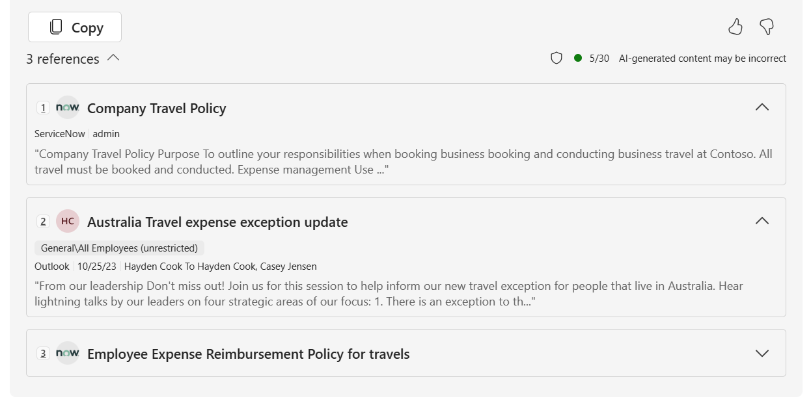

# Microsoft Graph Connectors for Microsoft 365 Copilot

Microsoft Graph connectors provide a platform for you to ingest your unstructured, line-of-business data into Microsoft Graph, so that Microsoft 365 Copilot can reason over the entirety of your enterprise content. Content ingested through Graph connectors is added to the Microsoft Graph; this unlocks semantic understanding of your users' prompts in Microsoft 365 Copilot. However, Graph connectors are not limited to Microsoft 365 Copilot. Graph connector content participates in other Microsoft 365 intelligent experiences like Microsoft Search, Context IQ, and the Microsoft 365 app.

> [!IMPORTANT]
>
> To learn more about pre-built connectors go to [Set up Microsoft built Graph Connectors](/microsoftsearch/configure-connector).

In this article, you will learn how your Graph connector content participates in Microsoft 365 Copilot and how to configure your custom Graph connections for Microsoft 365 Copilot.

:::image type="content" source="assets/images/copilot_graph-connectors-infographic.png" alt-text="This infographic summarizes how Microsoft Graph connectors make your data available to Microsoft 365 intelligent experiences" lightbox="assets/images/copilot_graph-connectors-infographic.png":::

## Watch the overview

> [!VIDEO https://www.youtube.com/embed/17rAOh9313g]

## How Microsoft Graph connector content surfaces in Microsoft 365 Copilot

By using Microsoft Graph connectors to ingest your external content into Microsoft Graph, your users can use Microsoft 365 Copilot to find, summarize, and learn from your line-of-business data through natural language prompts.

:::image type="content" source="assets/images/connectors-copilot-response.png" alt-text="A screenshot of Graph connectors in Microsoft 365 Copilot" lightbox="assets/images/connectors-copilot-response.png":::

In addition, users can hover over in-text citations in Microsoft 365 Copilot responses to get a preview of the external item referenced.

If users desire to dive deeper into the referenced content, they can select one of the reference links at the bottom of the response.

## Microsoft Graph connectors gallery

The [Microsoft Graph connectors gallery](https://www.microsoft.com/microsoft-search/connectors) includes a brief description of each of the connectors created by Microsoft and our partners, and a link to each partner's website.

With more than 100 connectors currently available, you can connect to popular Microsoft and non-Microsoft services such as Azure services, Box, Confluence, Google services, MediaWiki, Salesforce, ServiceNow, and many more.

Visit the connectors gallery to find all the information you need to get started using connectors.

 

> [!IMPORTANT]
>
> To learn more about pre-built connectors go to [Set up Microsoft built Graph Connectors](/microsoftsearch/configure-connector) .

## Create your own custom Microsoft Graph connection

You can use the [Microsoft Graph connectors APIs](/graph/connecting-external-content-connectors-api-overview?context=microsoft-365-copilot/extensibility/context) to build custom Microsoft Graph connections that index content from line-of-business data sources into Microsoft Graph. You can use the Microsoft Graph connectors APIs to create and manage external Microsoft Graph connections, define, and register the schema of external data types, ingest external data items into Microsoft Graph, and sync external groups.

## Configuring your custom Microsoft Graph connection for Microsoft 365 Copilot

To make sure that Microsoft 365 Copilot uses your content effectively:

- Apply [semantic labels](/graph/connecting-external-content-manage-schema). Semantic labels help Microsoft 365 Copilot interpret the semantic meaning of your schema. Apply as many of them to your schema as applicable. The `iconUrl`, `title`, and `url` labels must be applied for content to surface in Copilot. Currently, only the `title` semantic label can be used in prompts in Microsoft 365 Copilot. However, more semantic labels will be supported as the platform evolves, so applying all applicable labels will prevent you from needing to recreate your schema in the future.
- Ingest content relevant to external items as text. Users can query against the content property of external items in Microsoft 365 Copilot. Microsoft 365 Copilot performs better on content rich items.
- Add a [urlToItemResolver](/graph/api/resources/externalconnectors-urltoitemresolverbase) in [activitySettings](/graph/api/resources/externalconnectors-activitysettings) when you [create your connection](/graph/connecting-external-content-manage-connections#create-a-connection). A `urlToItemResolver` enables the platform to detect when users share URLs from your external content with each other. Microsoft 365 Copilot has a higher likelihood of displaying content that has been shared with that user.
- Add [user activities](/graph/api/externalconnectors-externalitem-addactivities) on your items. For a list of supported activity types, see [externalActivity](/graph/api/resources/externalconnectors-externalactivity). Items that have more activities are boosted in importance.
- Provide meaningful descriptions in the `description` property when [creating connections](/graph/api/externalconnectors-external-post-connections). Rich descriptions improve the likelihood of displaying content in Copilot.

In addition, search administrators must ensure that your Graph Connector connections are enabled for [inline results](/microsoftsearch/connectors-in-all-vertical), using the following steps.

- Open the [Admin Center](https://admin.microsoft.com/), go to **Search & intelligence** > **Customizations** > **Verticals** and select **All**.

- Select **Manage connector result**. Ensure that **Show results inline** is selected and that the connections that you want to enable for Search and Copilot are checked.

## See also

- [Microsoft Graph connectors APIs](/graph/connecting-external-content-connectors-api-overview?context=microsoft-365-copilot/extensibility/context)
