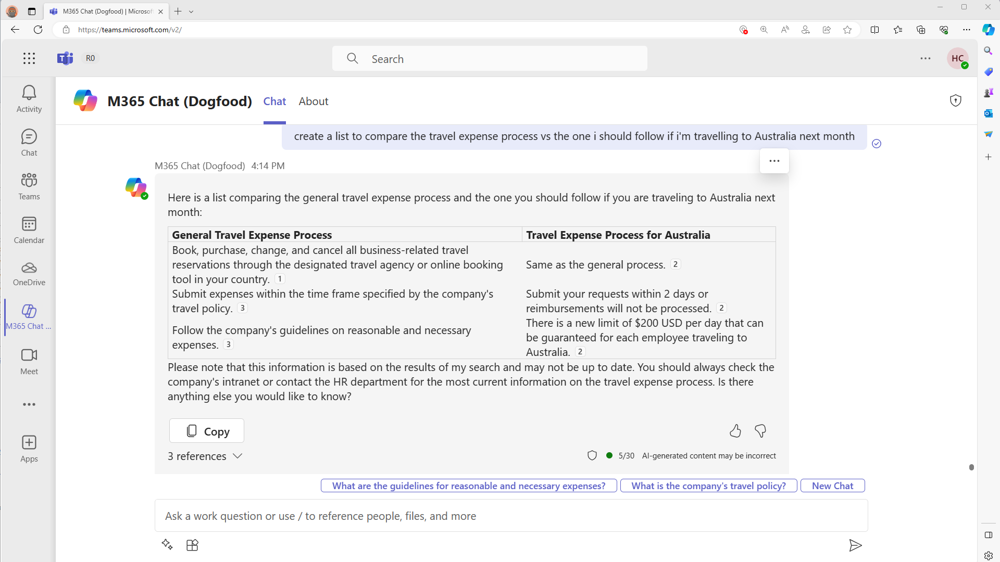

# Microsoft Graph Connectors for Microsoft 365 Copilot

Microsoft 365 Copilot is your copilot for work. It combines the power of Large Language Models (LLMs) and your data in Microsoft Graph to unlock productivity. However, organizational data is not limited to Microsoft content sources like OneDrive and SharePoint. Enterprise data is spread across many line-of-business content sources, and the entirety of your organization's data needs to participate in Microsoft 365 Copilot in order to maximize its benefits. Microsoft Graph connectors provide a platform for you to ingest your line-of-business data into Microsoft Graph, so that Microsoft 365 Copilot can reason over the entirety of your enterprise content.

## How Microsoft Graph connector content surfaces in Microsoft 365 Copilot

By using Microsoft Graph connectors to ingest your external content into Microsoft Graph, your users can use Microsoft 365 Copilot to find, summarize, and learn from your line-of-business data through natural language prompts.

In addition, users can hover over in-text citations in Microsoft 365 Copilot's response to get a preview of the external item referenced.

If users desire to dive deeper into the referenced content, they can click on one of the reference links at the bottom of the response.

## Create your own custom Microsoft Graph connection

You can use the [Microsoft Graph connectors APIs](/graph/connecting-external-content-connectors-api-overview?context=m365copilot/context) to build custom Microsoft Graph connections that index content from line-of-business data sources into Microsoft Graph. You can use the Microsoft Graph connectors APIs to create and manage external Microsoft Graph connections, define and register the schema of external data types, ingest external data items into Microsoft Graph, and sync external groups.

## Configuring your custom Microsoft Graph connection for Microsoft 365 Copilot

To make sure that Microsoft 365 Copilot uses your content effectively:

- Add a [urlToItemResolver](/graph/api/resources/externalconnectors-urltoitemresolverbase) in [activitySettings](/graph/api/resources/externalconnectors-activitysettings) when you [create your connection](/graph/connecting-external-content-manage-connections#create-a-connection?context=m365copilot/context). A `urlToItemResolver` enables the platform to detect when users share URLs from your external content with each other. Microsoft 365 Copilot has a higher likelihood of displaying content that has been shared with that user.
- Apply [semantic labels](/graph/connecting-external-content-manage-schema?context=m365copilot/context). Semantic labels help Microsoft 365 Copilot interpret the semantic meaning of your schema. Apply as many of them to your schema as applicable.
- Add [user activities](/graph/api/externalconnectors-externalitem-addactivities) on your items. For a list of supported activity types, see [externalActivity](/graph/api/resources/externalconnectors-externalactivity). Items that have more activities are boosted in importance.

## See also

- [Microsoft Graph connectors APIs](/graph/connecting-external-content-connectors-api-overview?context=m365copilot/context)
